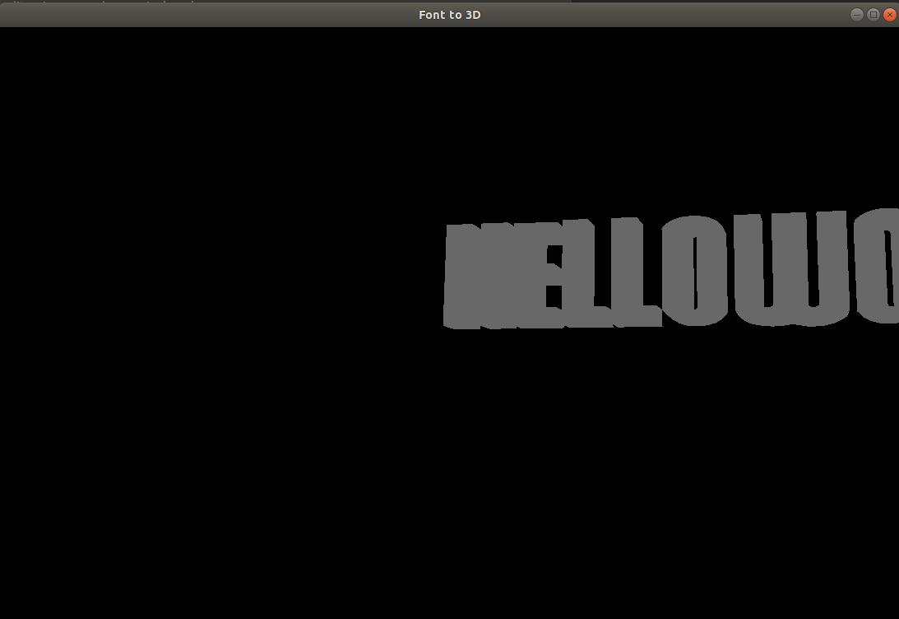

# Font23D
Font23D is a C++ library for creating a 3d mesh of any Text in the given True type font.

## Compile the code
Install the dependancies 

```sh
sudo apt install libfreetype6-dev
sudo apt install freeglut3-dev
```
Now just run the bash script to get the 3d preview. 
```sh
sh compile.sh
```
You should be seeing this 


Instruction to use:
* The Library uses FreeType Library to decode the fonts and converts the Text into Vector.
* Then the vector data is converted into triangles using Ploy2Tri library.
* This gives us the triangles of the complete text in a plane.
* The plane is then extruded into 3d object and then creates a closed mesh.
* The Mesh is then rendered using OpenGL.

Plans for Future:
* Allow Option to export the Mesh into OBJ file.
* Add Support for Unicode text.