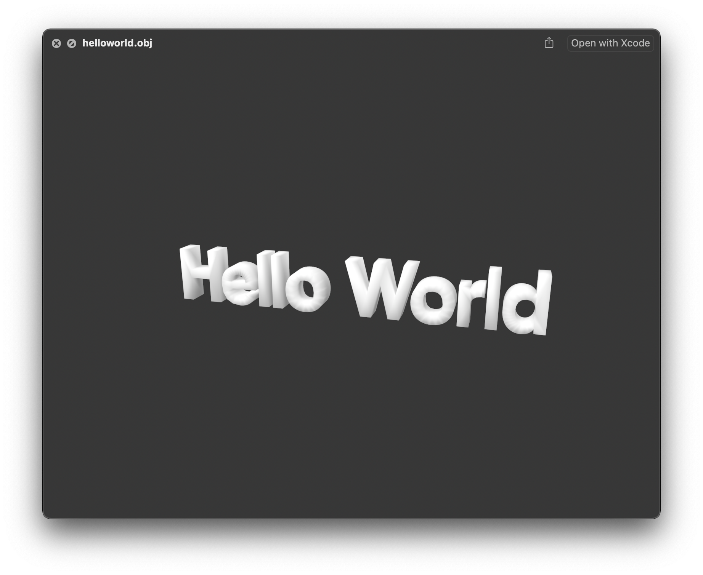
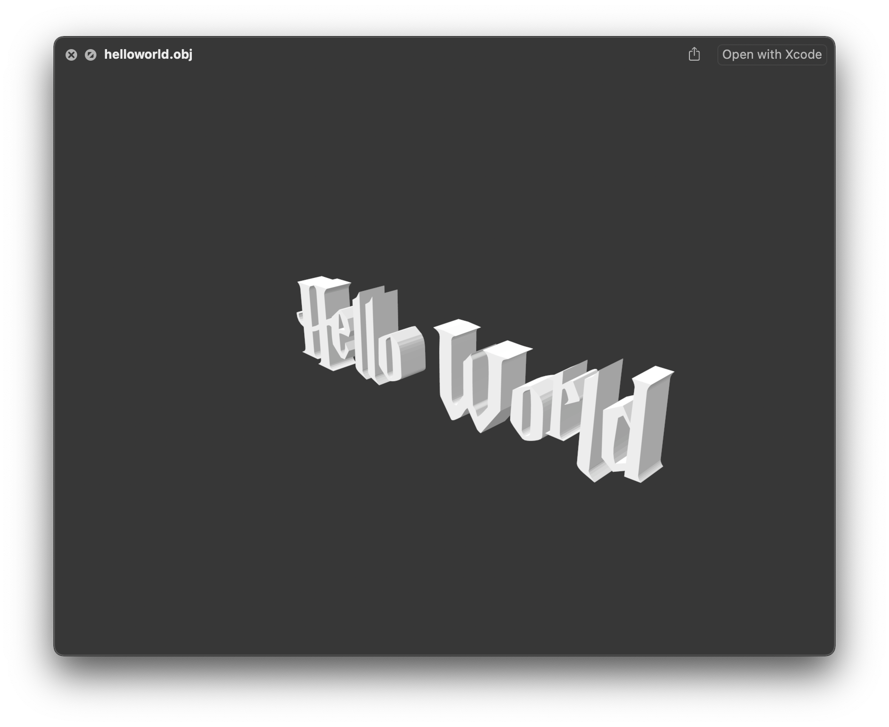
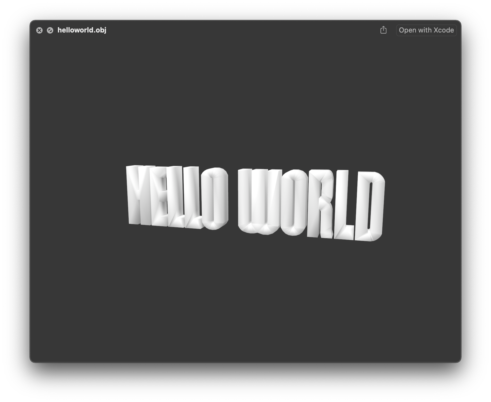
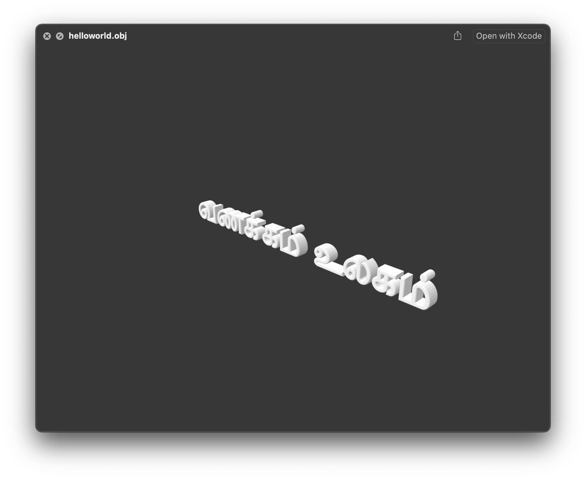

# Font23D
Font23D is a C++ library for creating a 3d mesh of any Text in the given True type font.

Demo: [Font23D running on browser using webassembly](https://codetiger.github.io/Font23D/webassembly/)

## Compile the code
Install the dependancies 

```sh
sudo apt install libfreetype6-dev
```

Now just run the bash script to get the OBJ file output. 
```sh
sh compile.sh
```

## Sample Outputs
Below outputs are generated using different fonts




Unicode Support


Instruction to use:
* The Library uses FreeType Library to decode the fonts and converts the Text into Vector.
* Then the vector data is converted into triangles using Ploy2Tri library.
* This gives us the triangles of the complete text in a plane.
* The plane is then extruded into 3d object and then creates a closed mesh.
* The Mesh is then saved as OBJ file.

Plans for Future:
* Support WebAssembly and create sample web page to convert input text using uploaded font to 3D mesh.

Contributions:
* Thanks to J.Scheurich from [White Dune Project](http://wdune.ourproject.org/) for suggesting fixes for Face culling.
* Thanks to DaegyuMin for fixing a bug in missing triangle.
